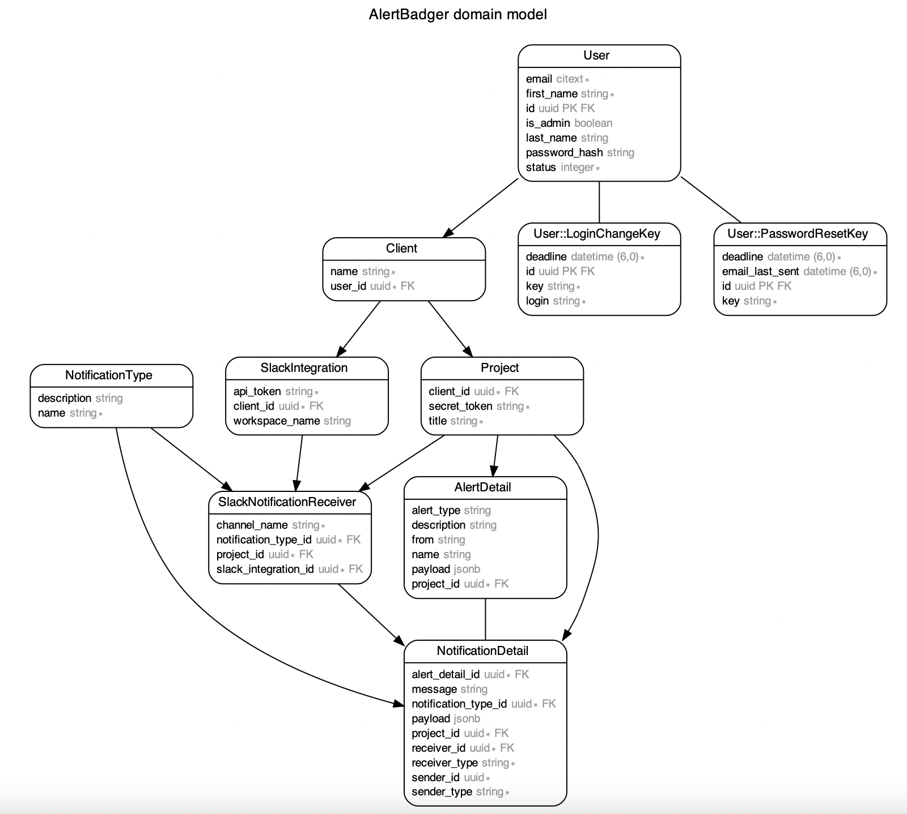

# Alert Badger

As per the assignment, requirements were limited to Create a production-ready web endpoint that accepts a JSON payload as a POST request and sends an alert to a Slack channel if the payload matches desired criteria. Requirements were straight forward. I took the liberty to build a product which provides following functional and non-fucntion features around the core requirement. But keeping estimated time in mind, I'll be providing seed file to populate database with relevant data so that we can leave implementation of additional APIs for later stage and only focus on core requirement for this submission.

* Authentication - Currently uses Basic auth to secure endpoint so that no one can misuse endpoint in sending spam/explicit messages to slack channels. It can be change to more secured signature based authentication with minimal additions.
* Retry mechanism with exponential backoff using wait and jitter options in active job's retry_on callback
* Throttling using rack-attack
* Using application-level encryption supported by Active record to securely store slack api tokens and basic auth secret tokens
* Extendable database design which can accomodate multiple clients and each client can have multiple projects and client can setup project specific slack alert for N number of alery types. See [this](#database-schema)
* Additional communication channels such as Email, SMS, can be added with minimal modification in current database design
* Code is divided across services such as SpamDetection so that new services can be added quicker and code is easier to understand. See [this](#services)
* Docker
* Test coverage
* JWT based user authentication
* Uses UUIDs in-place of IDs to reference records so that record ids are not prone to guessing. 

## Dependencies

* Ruby - "3.0.4"
* Rails - "~> 7.0.4"
* Postgresql
* Docker
* Postman
* [Slack-api-client](https://github.com/slack-ruby/slack-ruby-client)
* Some important gems/tools : [Rodauth](https://github.com/janko/rodauth-rails), [Erd](https://github.com/voormedia/rails-erd), [Rspec](https://github.com/rspec/rspec-rails), [Webmock](https://github.com/bblimke/webmock), [Rack-attack](https://github.com/rack/rack-attack)

## Installation

Note - 1 - You don't need to install rails, ruby, postgresql in your local system if you want to setup project only using docker. After installing docker, See [this](#docker) section to setup project using docker. 

Note - 2 - As I wasn't provided with any email address with which I can share the private github repo that is why project repo is public. And for the same reason, I had to commit master.key file which is important for active record encryption. Otherwise I would've shared such credentials separately in email.

1. Please install Ruby if you don't already have one installed. You can follow steps from following link for the installation.

    https://www.ruby-lang.org/en/documentation/installation/
2. Install Rails

    https://guides.rubyonrails.org/v5.1/getting_started.html#installing-rails
3. Install Postgresql db

    https://www.postgresql.org/download/macosx/
4. Install Docker

    https://www.docker.com/products/docker-desktop/
5. Install Postman

    https://www.postman.com/
6. Obtain Slack API token

    To receive slack alert. You've to create a slack bot and integrate it into your slack workspace. Please follow below steps:

    a. Create new slack app
        
    https://api.slack.com/apps

    b. Click on ``Oauth & Permissions`` item from left side menu

    c. Go to ``Scopes`` section and add Oauth scopes. You must add ``chat:write`` scope in order to send messages to slack channels

    d. Go to ``OAuth Tokens for Your Workspace`` section on same screen and note down your Slack API token

    e. Add bot into your slack channel where you want to receive alers. 

    d. Note down channel's name with ``#``

## Setup

There are three ways to setup this project.

1. [From source and localhost](#source-and-localhost)
2. [From source and docker](#source-and-docker)

Let me explain each method.

### Source and Localhost
1. Clone this repo in your local system using
    ````bash
    git clone https://github.com/bittu-choudhary/alert-badger.git
    ````
2. Make sure your local postgresql server is up and running.
3. Run 
    ```
    bundle install
    ```
4. Change following database configuration as per your system in ```config/database.yml```

    ```
    host: localhost
    username: <your-postgresql-username>
    password: <your-postgresql-password>
    ```
5. Create database
    ```
    bin/rails db:create
    ```
6. Migrate database
    ```
    rails db:migrate
    ```
7. Add Slack API token, Slack channel Name and basic auth secret token in ``seed.rb`` file
8. Seed database
    ```
    rails db:seed
    ```

9. Run rails server and use APIs. For API usage, [check below](#usage) . 
    ```
    rails s
    ```
10. Your app is up and running on 
    ````bash
    http://127.0.0.1:3000
    ````
### Source and docker
1. Clone this repo in your local system using
    ````bash
    git clone https://github.com/bittu-choudhary/alert-badger.git
    ````
2. change directory to code folder and run following command.
    ```
    docker compose -f docker-compose.yml -f docker-compose-dev.yml up --build
    ```
3. Above command should run following three containers
    ```
    ad_postgres
    pgadmin4
    alert_badger
    ```
4. Run migrations
    ```
    docker-compose run alert_badger rake db:migrate
    ```
5. Add Slack API token, Slack channel Name and basic auth secret token in ``seed.rb`` file
6. Seed database
    ```
    docker-compose run alert_badger rake db:seed
    ```
7. Your app is up and running on 
    ````bash
    http://127.0.0.1:3000
    ````
8. Docker is setup to run pgadmin client. Read [this](#pgadmin-setup) section to know more.

### Pgadmin Setup
1. You can access pgadmin web client using following credentials.

    ```
    host: http://localhost:12345/
    email: bittu@test.com
    password: password
    ```
2. Click on `Add new server` and use following configurations in respective tab and `save`
    ```
    - TabName
        Configuration
    - General
        Name - <choose-any-server-name> 
    - Connection
        Host - postgres
        Username - alert_badger_app
        Password - password
    ```
3. You should see new server added to left side pan. Expand it and you can access databases. 

# Usage

Project includes [Postman](https://www.postman.com/) API client's [collection](api-doc/postman-resources/alert-badger.postman_collection.json) and [environment](api-doc/postman-resources/alert-badger.postman_environment.json). 

You can use following API to send alert.

* Alert
    * [Create](api-doc/alerts/create.md) : `POST /api/v1/alerts`

**Accessing rails console**

1. For [source and localhost](#source-and-localhost) setup run :-

    ```
    rails c
    ```
2. For [source and docker](#source-and-docker) setup, run :- 
    ```
    docker compose run alert_badger rails c
    ```

# Testing

Application uses [Rspec](https://github.com/rspec/rspec-rails). To run test suits, run below command.

```
rspec
```

For more details regarding options and documentation, read [here](https://github.com/rspec/rspec-rails)

# Additional Details


### Database schema


Idea was to design a schema which can be use as a standalone product for alerting clients based on their preferences. Here is brief summary of each table and their association with each other

1. User - Keep record of all users. keeps a boolean to differentiate admins
2. Client - Client belongs to User. It contains client specific details
3. Project - Project belongs to client. Client can have many projects. Store project specific information and secret token unique to each project. Project name and secret token is being used as credentials for basic authentication
4. Slack Integration - Stores slack workspace details such as workspace name and slack api token. Belongs to client. Client can have many slack integrations
5. Slack Notification Receiver - Stores slack channel details and their relationship with projects and notification types. Client can customize slack alert preferences based on combination of projects, types and channels. Belongs to Notification type, Belongs to projects, Belongs to Slack Integration
6. Notification Type - Stores type of notifications
7. Alert Details - Stores details of all incoming alerts including their payload. Belongs to Project.
8. Notification Detail - Store details of all outgoing notifications including slack alerts. Belongs to Projects, Alert Details, Notification Type, Slack Notification Receivers.

### Services

This project uses three services to keep code clean and modular. 

1. Alert Handler - It takes care of all operations related to alert object. It inspects alert object and do needful based on result of inspection
2. Spam Detection - It takes care of rules and policies which determines if an alert is spam or not
3. Slack Notifier - It takes care of extracting alert receivers and schedules slack alert to all those receivers